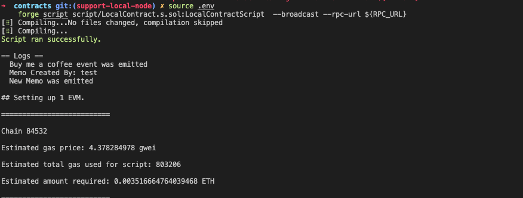

# Contracts

This directory host the smart contract that enables cross chain stable asset payment.

## Introduction

### Contracts

## Dev Note

- source chain: base sepolia
- desitination chain: arbitrum sepolia

### Set env vars

- PRIVATE_KEY
- BASE_SEPOLIA_RPC_URL
- ARBITRUM_SEPOLIA_RPC_URL

### Deploy / Fund token port on source chain

deploy and send init fund to the token port contract on Base sepolia

```
forge script ./script/00_TokenPort.s.sol:DeployTokenPort -vvv --broadcast --rpc-url base_sepolia --sig "run(uint8, uint256)" -- 6 0.01ether
```

command to send more fund to the contract

```
cast send <TOKEN_PORT_ADDRESS> --rpc-url base_sepolia --private-key=$PRIVATE_KEY --value 0.05ether
```

### Deploy token port on destination chain

deploy and send init fund to the token port contract on Arbitrum sepolia

```
forge script ./script/00_TokenPort.s.sol:DeployTokenPort -vvv --broadcast --rpc-url arbitrum_sepolia --sig "run(uint8, uint256)" -- 2 0.01ether
```

command to send more fund to the contract

```
cast send <TOKEN_PORT_ADDRESS> --rpc-url arbitrum_sepolia --private-key=$PRIVATE_KEY --value 0.05ether
```

### Send token (USDC) from source chain

```
forge script ./script/SendToken.s.sol:SendToken -vvv --broadcast --rpc-url base_sepolia --sig "run(address,uint8,address,string,address,uint256)" -- 0x0c7D4Ae8ad01e521cE44d3aee1ce9acd59EE73eD 2 0x0c7D4Ae8ad01e521cE44d3aee1ce9acd59EE73eD "LFG" 0x036CbD53842c5426634e7929541eC2318f3dCF7e 100
```

### Verify receive on the destination chain

```
cast call 0x0c7D4Ae8ad01e521cE44d3aee1ce9acd59EE73eD "getLastReceivedMessageDetails()" --rpc-url arbitrum_sepolia
```

### withdraw token from the token port

```
cast send 0x0c7D4Ae8ad01e521cE44d3aee1ce9acd59EE73eD "withdraw(address)" 0x643768330dD3C34DBFe7c842fF3776A0A69A4d24 --rpc-url arbitrum_sepolia --private-key $PRIVATE_KEY
```

### Deployed contracts

**Base Sepolia**

- TokenPort.sol: 0x0c7D4Ae8ad01e521cE44d3aee1ce9acd59EE73eD

**Arbitrum Sepolia**

- TokenPort.sol: 0x0c7D4Ae8ad01e521cE44d3aee1ce9acd59EE73eD

## Usage

### Installation

Install foundry using

```shell
curl -L https://foundry.paradigm.xyz | bash
foundryup
```

Follow the instructions of foundryup to completely setup foundry

### Install dependencies

```shell
forge install
```

### Build

```shell
forge build
```

### Test

```shell
forge test
```

### Coverage

You will need to install [genhtml](https://github.com/linux-test-project/lcov) to generate html reports (`brew install lcov` for osx).

```shell
forge coverage --report lcov && genhtml -o report --branch-coverage lcov.info
```

### Format

```shell
forge fmt
```

### Deploy and verify contracts on Base Sepolia

Open `.env` file.

`PRIVATE_KEY` is your private wallet key. Make sure to prefix it by "0x" to convert to a hex string.

`BLOCK_EXPLORER_API_KEY` is your API Key from [basescan.org](https://docs.basescan.org/getting-started) for Base Sepolia

```bash
source .env

forge script script/BuyMeACoffee.s.sol:BuyMeACoffeeScript --broadcast --verify --rpc-url base_sepolia
```

<b>Note: The above command will print the address of your contract and a link to the block explorer. Click on the block explorer link to verify whether your contract has been deployed or not </b>


Forge runs your solidity script. In that script it tries to broadcast the transaction. It writes it back into the broadcast folder in a `run-latest.json` file.

### ABI

To extract the `abi` of your contract, you can go to `out/BuyMeACoffee.sol/BuyMeACoffee.json` and copy the value corresponding to the `abi` key

## Deploying your own contract

1. To deploy your own contract create a new `.sol` file inside the `contracts/src` folder, similar to `BuyMeACoffee.sol`
2. Format and build your contracts using `forge fmt` and `forge build` respectively.
3. Write some tests by creating a test file inside `contracts/test` folder, similar to `BuyMeACoffee.t.sol`. Run the test using `forge test`
4. Write a deployment script inside `contracts/script`, similar to `BuyMeACoffee.s.sol`
5. Create a `.env` file using the `.env.example` file provided in your contracts folder and add your private key. Make sure to add a `0x` in front of your key to convert it to a hex string.
6. Deploy your contract using the following commands:

   ```bash
   source .env

   forge script script/YOUR_SCRIPT.s.sol:YOUR_SCRIPT --broadcast --rpc-url base_sepolia
   ```

   Note: To deploy on a different network, simply add the specific RPC endpoint within the `[rpc_endpoints]` section found in the `foundry.toml` file.
   <br/>

7. To extract the `abi` of your contract, you can go to `out/YOUR_CONTRACT.sol/YOUR_CONTRACT.json` and copy the value corresponding to the `abi` key

To deploy the contract:

- Make sure to delete the following lines from `foundry.toml` because locally we dont have a block explorer

  ```
  [etherscan]
  "${NETWORK}"={key="${BLOCK_EXPLORER_API_KEY}"}
  ```

- Create a `.env` file using the `.env.example` file provided in your contracts folder and add one the private keys printed on your terminal when you ran `make local-node`. Also update the `RPC_URL` to `http://127.0.0.1:8545`, this will make sure your contracts are deployed locally

- Deploy the sample contract using:
  ```
  source .env
  forge script script/LocalContract.s.sol:LocalContractScript  --broadcast --rpc-url ${RPC_URL}
  ```



You can observe that the console2 library facilitates the addition of console logs in the contract, which would not have been possible if you were deploying to a testnet or mainnet.
